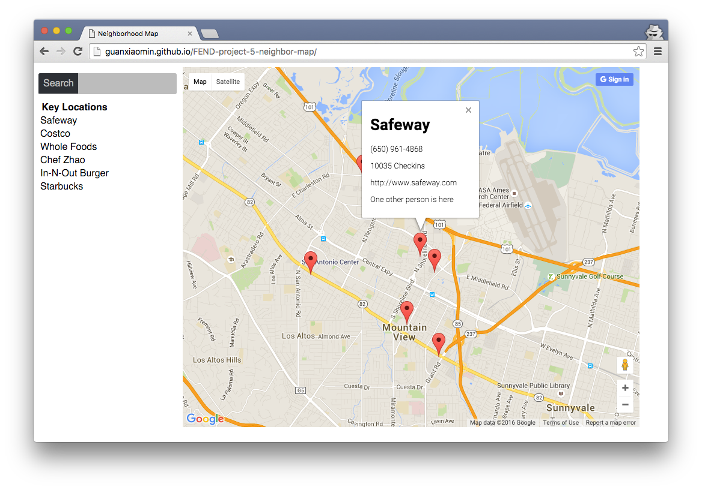
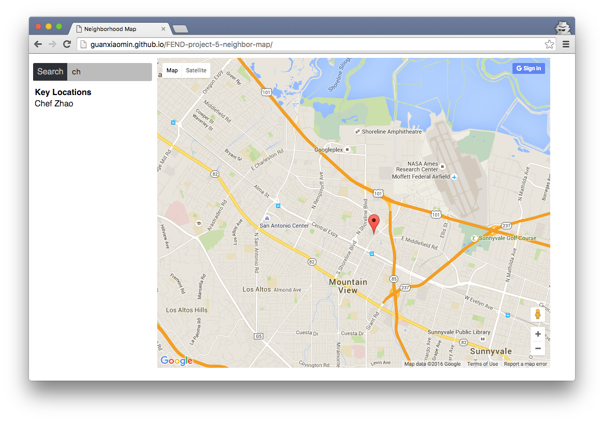

#FEND Project 5-1 -- Neighborhood Map Project

##Overview
A single page application featuring a map of naighborhood. Including live search locations and show Foursquare infomation on Info window of location marker.

Click [HERE](http://guanxiaomin.github.io/FEND-project-5-neighbor-map/) to view neighborhood map.

##Key Features
* Live searching
* Foursquare API allocated

## References
* [Google Maps JavaScript API](https://developers.google.com/maps/documentation/javascript/tutorial)
* [A Beginners Guide to KnockoutJS: Basics and Observables](http://www.sitepoint.com/beginners-guide-to-knockoutjs-part-1/)
* [Knockout JS](http://knockoutjs.com/documentation/introduction.html)
* [Foursquare API](https://developer.foursquare.com/start)

##Screenshot

